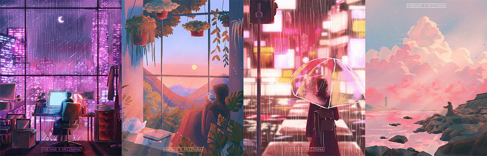

<h1 align="center">Janvi Singhal | MERN Developer + Blockchain Explorer</h1>

  

  
  
  

  

<b>I build, ship, and share in public.
I am growing a creator-first developer brand around full-stack products, backend systems, and open-source contributions.</b>
<b><i>Currently learning: Advanced Backend Engineering and Cloud-native Architectures.</i></b>

---

<h2 align="center">✨ About Me ✨</h2>

<table>
  <tr>
    <td width="72%" valign="top">
      <ul>
        <li>I build and ship real-world products across <b>backend</b> and <b>full-stack development.</b></li>
        <li>I turn experiments into clear learnings and share practical workflows as a tech creator.</li>
        <li>I actively collaborate with developers and open-source communities worldwide.</li>
        <li>I am currently focused on scalable architecture, backend engineering, and clean system design.</li>
        <li>Ask me about React, Node.js, JavaScript, MongoDB, and product building.</li>
        <li>Fun fact: anime is my favorite reset after long coding sessions.</li>
      </ul>
    </td>
    <td width="28%" valign="middle" style="padding-right: 20px; text-align: right;">
      
    </td>
  </tr>
</table>

  

---

<h2 align="center">🏆 Achievements 🏆</h2>

<table align="center">
  <tr>
    <td width="72%" valign="top">
      <ul>
        <li>Active open-source contributor with community collaborations.</li>
        <li>Consistent build-in-public creator journey.</li>
        <li>Passionate about MERN stack, cloud technologies, and cybersecurity.</li>
        <li>Regular contributor with <strong>daily coding streaks</strong> and growing impact.</li>
      </ul>
    </td>
    <td width="28%" align="center" valign="top">
      
    </td>
  </tr>
</table>

---

<h2 align="center">💮 Favorite Tech 💮</h2>

Tools, languages, and platforms I like to build with.

<table align="center" cellpadding="10" cellspacing="8">
  <tr>
    <td align="center" width="110"> TypeScript</td>
    <td align="center" width="110"> JavaScript</td>
    <td align="center" width="110"> Python</td>
    <td align="center" width="110"> SQL</td>
    <td align="center" width="110"> React.js</td>
    <td align="center" width="110"> Next.js</td>
  </tr>
  <tr>
    <td align="center"> Tailwind CSS</td>
    <td align="center"> Redux</td>
    <td align="center"> Node.js</td>
    <td align="center"> GraphQL</td>
    <td align="center"> PostgreSQL</td>
    <td align="center"> MongoDB</td>
  </tr>
  <tr>
    <td align="center"> Redis</td>
    <td align="center"> Prisma ORM</td>
    <td align="center"> Supabase</td>
    <td align="center"> AWS</td>
    <td align="center"> Docker</td>
    <td align="center"> CI/CD</td>
  </tr>
</table>

---

<h2 align="center">🎀 Follow My Journey 🎀</h2>

<table align="center">
  <tr>
    <td valign="top" align="center" width="230">
      
    </td>
    <td valign="top">
      <table align="center" cellpadding="10" cellspacing="8">
        <tr>
          <td align="center" width="110"><a href="https://github.com/janvibuilds"> GitHub</a></td>
          <td align="center" width="110"><a href="https://www.linkedin.com/in/janvi-singhal-61299a207/"> LinkedIn</a></td>
          <td align="center" width="110"><a href="https://janvisinghal.vercel.app/"> Portfolio</a></td>
          <td align="center" width="110"><a href="https://x.com/janvi_sing29143"> X (Twitter)</a></td>
        </tr>
        <tr>
          <td align="center" width="110"><a href="https://app.daily.dev/janvibuilds"> Daily.dev</a></td>
          <td align="center" width="110"><a href="https://stackoverflow.com/users/27863308/janvi-singhal"> Stack Overflow</a></td>
          <td align="center" width="110"><a href="https://dev.to/janvi_singhal_3b62461ab4e"> DEV.to</a></td>
          <td align="center" width="110"><a href="https://medium.com/@janvisinghal10"> Medium</a></td>
        </tr>
      </table>
    </td>
  </tr>
</table>

---

<h2 align="center">👀 Profile Views 👀</h2>

<table align="center">
  <tr>
    <td align="center" valign="middle" style="padding-left: 12px;">
      
    </td>
    <td align="center" valign="middle" style="padding-right: 12px;">
      
    </td>
  </tr>
</table>

---

  <h2>🌟 Open Source Contributions 🌟</h2>

  

  

  <table align="center">
    <tr>
      <td align="center"></td>
      <td align="center"></td>
    </tr>
  </table>

---

<h2 align="center">📊 GitHub Stats 📊</h2>

<table align="center">
  <tr>
    <td colspan="2">
      
    </td>
  </tr>
  <tr>
    <td colspan="2">
      
    </td>
  </tr>
  <tr>
    <td>
      
    </td>
    <td>
      
    </td>
  </tr>
  <tr>
    <td>
      
    </td>
    <td>
      
    </td>
  </tr>
</table>

---

<!-- Contribution heatmaps and fun visualizations from my GitHub activity. -->

      

  

  

<!-- Cherry blossom divider -->

<!-- SUPPORT MY WORK -->

  
  
  
  

